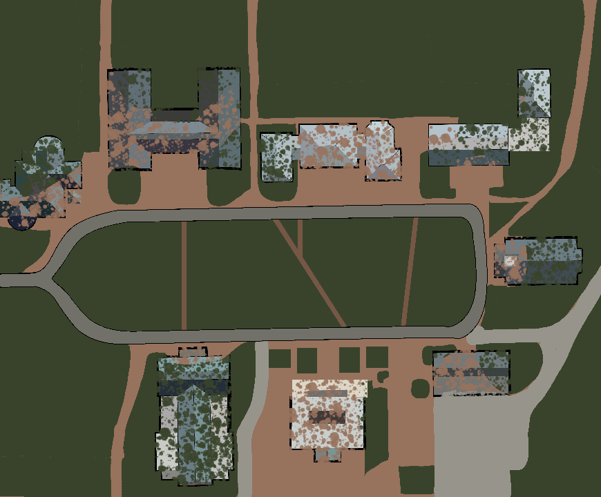
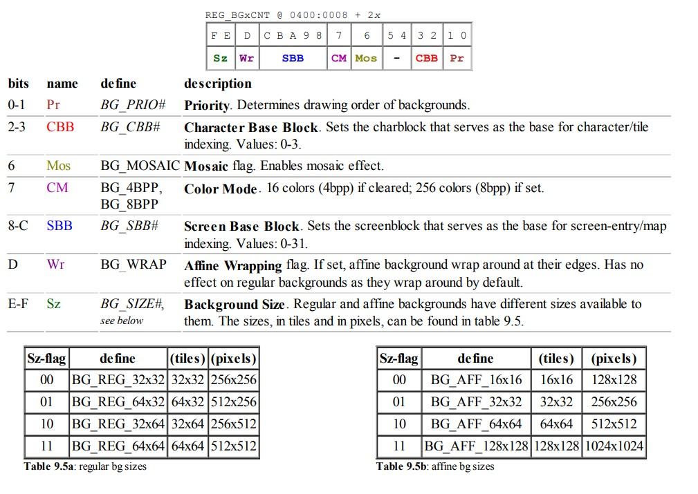
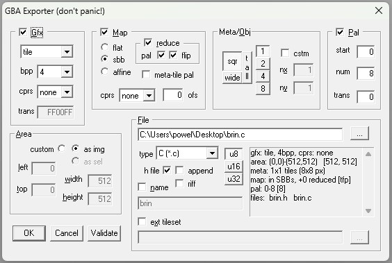
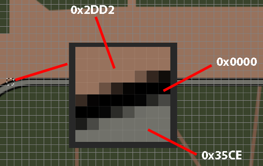

# Regular Tiled Backgrounds
We will be using the Usenti program to convert .png image files to .c and .h Background Tiles

## Notes on The Background Image
- The original background is **870 x 728 px**

    

    <b>Fig 1</b>: Background of Scratch game.

<!-- - The size of each tile is always 8×8 pixels
- Thus we should have 60 x 40 Tiles = **2,400 Tiles**
- Colors Needed: Grass, Road, Sidewalk, Buildings, Brick
- Palette thus has 5 Colors needed
- Backgrounds can use these palettes in two ways: as a single palette with 256 colors (8 bits per pixel); or as 16 sub-palettes or palette banks of 16 colors (4 bits per pixel).
- We should only need the **4bpp** since our background is simple (for now). -->

### Problems
- **Background Size**:
    - Regular and affine backgrounds have different sizes available to them:

        

        <b>Fig 2</b>: Outline of REG_BGxCNT taken from the tonc text

    - Usenti will only export bitmaps with dimensions in multiples of 256. 
    This means Our width and height should only take values of **256, 512 , 768, or 1024**.
    However, a regular background can only be up to **512 x 512**
- **Background Quality**:
    - The Original Background for the Scratch Game was done very poorly in photoshop and looks bad on the GBA

### Solutions
- **Background Size**:
    - Scale the 870 x 728 background to 512 x 429.
    - To make the overall image 512 x 512, Usenti will add 512 x 83 white pixels at the bottom of the image during export
- **Background Quality**:
    - To make up for the poor image quality, I redid the background in photoshop

        

        <b>Fig 3</b>: New Background image.

## Using Usenti to Convert PNG to Tiled Map
1. Open usenti
2. Open the map png
3. Image > Export
4. Change file type to GBA Source (.c)
5. Use these properties

    

    <b>Fig 4</b>: Sceenshot of Usenti Export

6. Usenti should have exported a .c and .h file in the location you exported to

**Def**: The list of unique tiles is the **tileset**. The image is divided into a matrix of tiles. Each element in the matrix has a tile index which indicates which tile should be rendered there. This is known as the **tilemap**. The list of unique colors of pixels is called the **palette**.

<!-- ## Essential tilemap steps
1. Load the graphics: tiles into charblocks and colors in the background palette.
2. Load a map into one or more screenblocks.
3. Switch to the right mode in REG_DISPCNT and activate a background.
4. Initialize that background's control register to use the right CBB, SBB and bitdepth. -->

## Structure of the Tiles Map in C
```C

onst unsigned char bgrTiles[12928] __attribute__((aligned(4)))=
{
    // Some data here
}

onst unsigned char bgrMap[8192] __attribute__((aligned(4)))=
{
    // Map row 0
    0x0000,0x0000,0x0000,0x0000,0x0000,0x0000,0x3001,0x3002,
    0x0000,0x0000,0x0000,0x0000,0x0000,0x0000,0x0000,0x0000,
    0x3001,0x3002,0x0000,0x0000,0x0000,0x0000,0x0000,0x0000,
    0x3001,0x3002,0x0000,0x0000,0x3001,0x3002,0x0000,0x0000,

    // Map row 1
    0x0000,0x0000,0x0000,0x0000,0x0000,0x0000,0x3003,0x3004,
    0x0000,0x0000,0x0000,0x0000,0x0000,0x0000,0x0000,0x0000,
    0x3003,0x3004,0x0000,0x0000,0x0000,0x0000,0x0000,0x0000,
    0x3003,0x3004,0x0000,0x0000,0x3003,0x3004,0x0000,0x0000,

    // ... etc
}

const unsigned char bgrPal[16] __attribute__((aligned(4)))=
{
    0x1507,0x39AC,0x2DD2,0x4652,0x35CE,0x0000,0x0000,0x0000,
    // Pal needs to be a multiple of 8 (thats why all the black 0x0000 values) Not sure why?
};
```
To understand what's happening here a bit better lets look closer at Figure 3:



<b>Fig 5</b>: Close up of the new map